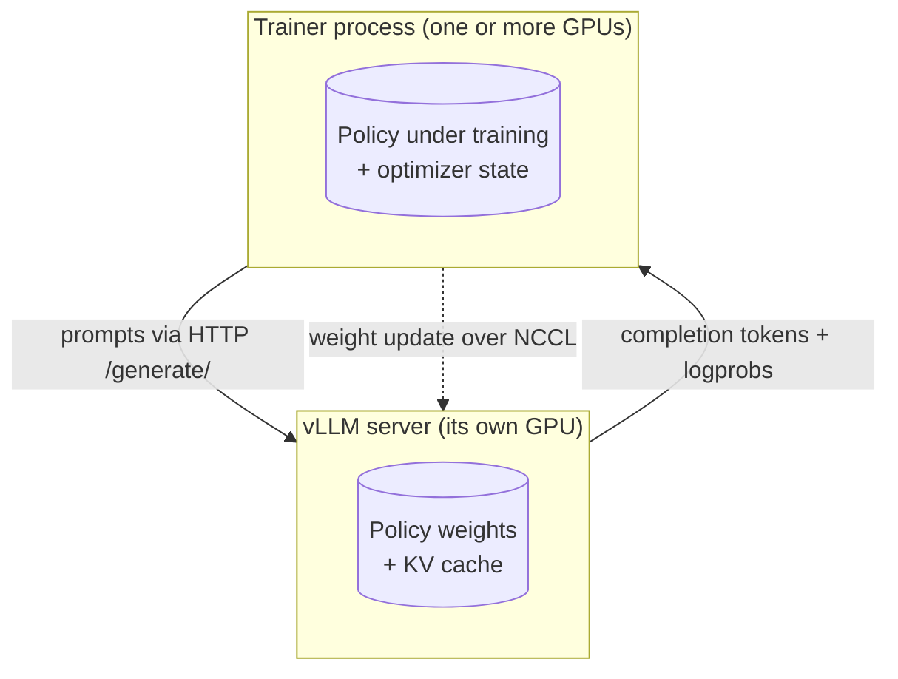
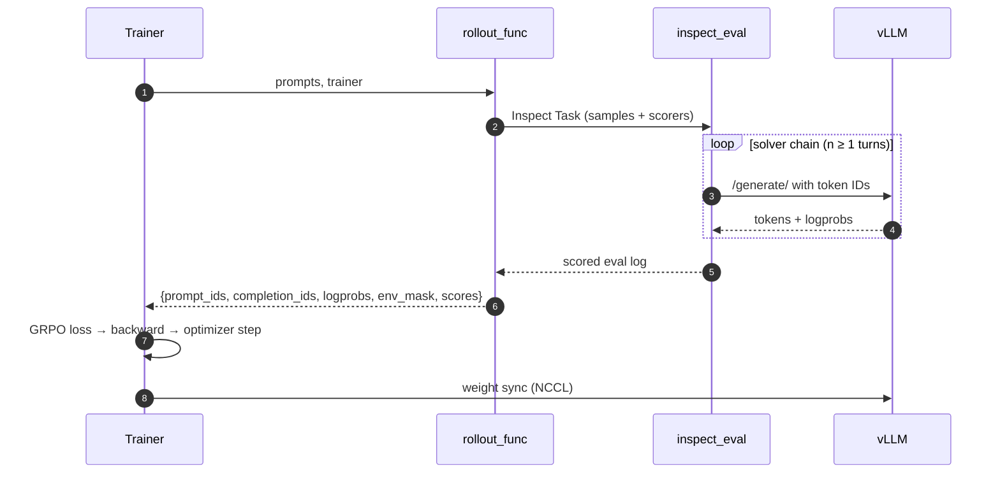
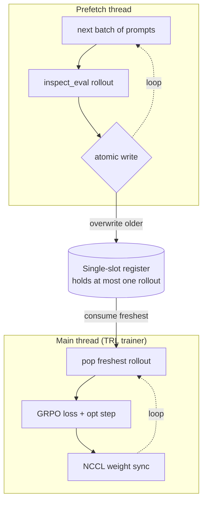

# 03 — How it works (internals)

*Last updated: 2026-05-15*

The implementation details behind the rollout/training split.

## The two-process boundary



The trainer and vLLM run as separate processes on separate physical GPUs (NCCL refuses to bind two ranks to the same device). Two channels cross between them:

- **HTTP** carries pre-tokenized prompts out and tokens + logprobs back — one round-trip per turn for tool-using agents.
- **A persistent NCCL communicator** pushes updated weights into the running vLLM after each optimizer step, so the next rollout samples from the current policy.

## One training step, in order



Inside one step, the trainer hands prompts to `rollout_func`, which runs the full Inspect eval — solvers, tools, scorers, potentially many vLLM round-trips per sample. Token-level data comes back in the dict TRL expects; reward functions just look up pre-computed `inspect_scores`. After the loss + optimizer step, NCCL pushes new weights into vLLM so the *next* step's rollout uses the fresh policy.

## Async prefetch (off-policy mode)



When `off_policy_steps != 0`, a background thread keeps vLLM busy generating rollouts and atomically writes each completed one into a single-slot register — older results are dropped. The trainer consumes whatever the producer most recently finished, never blocking on rollout completion. TRL's truncated importance sampling (`current_logp − sampling_logp`, capped at `vllm_importance_sampling_cap=3.0`) corrects for the staleness gap. With `off_policy_steps=-1` (the default), `AutoCalibratingRolloutFunc` measures rollout vs train time over a warmup window and only flips this prefetch on if it would help.

## Rollout sequence (single step, detailed)

```text
Trainer (TRL GRPO)
  │
  ├─ rollout_func(prompts, trainer)
  │    │
  │    ├─ Reconstruct Inspect Samples from TRL prompts
  │    ├─ inspect_eval(task, model=TRLVLLMProvider)
  │    │    ├─ Full solver chain runs (generate, tools, sandbox…)
  │    │    ├─ Scorers compute rewards
  │    │    └─ Provider stashes token IDs + logprobs per turn
  │    └─ Return {prompt_ids, completion_ids, logprobs, env_mask, inspect_scores}
  │
  ├─ reward_funcs read pre-computed inspect_scores
  ├─ GRPO loss (masked by env_mask) → backward → weight update
  └─ NCCL sync weights to vLLM server
```

## TRL's `RolloutFunc` interface

By default TRL's `GRPOTrainer` owns the rollout step: it sends prompts to vLLM, decodes completions, runs `reward_funcs(completions)`, and computes the GRPO loss. `RolloutFunc` is TRL's extension point for replacing that rollout with your own:

```python
rollout_func(prompts: list[list[dict]], trainer: GRPOTrainer) -> dict
```

The returned dict must contain `prompt_ids`, `completion_ids`, and `logprobs`; it may also contain `env_mask` and arbitrary extras (we use `inspect_scores`). TRL skips its internal rollout when these are present and uses the provided tensors directly.

This is the hook that lets Inspect own the rollout. The reward functions TRL still requires are thin — they just pluck per-sample numbers out of `inspect_scores`; the actual scoring happened inside Inspect's scorer chain. See `src/inspect_rl/core/rollout.py:58`.

## Why token IDs and logprobs (not just text)

GRPO's loss is a per-token importance-weighted advantage. At each position it needs:

- **`completion_ids`** — the exact tokens sampled by the behavior policy. If we round-tripped through text and re-tokenized, BPE re-encoding would drift: the detokenized string of a sampled token sequence doesn't always re-encode back to those same IDs (suboptimal merges canonicalize). That breaks the per-token alignment between old logprobs and the training-time forward pass.
- **`logprobs`** — the log-probabilities under the behavior (sampling) policy, used as the denominator of the importance ratio. Recomputing them from text would have the same re-tokenization drift, plus a second forward pass.
- **`prompt_ids`** — the exact prefix the policy conditioned on, so training-time logprobs are computed against the same context.

In a multi-turn setting the constraint gets tighter: turn *n+1*'s prompt must literally extend turn *n*'s `prompt_ids + completion_ids`, otherwise you can't concatenate the trajectory into a single sequence for the loss. Any re-tokenization between turns breaks this invariant. `_aggregate_turns` in `rollout.py` checks it explicitly and raises with a diff if template/tokenizer drift has crept in.

## Why a custom vLLM provider

Inspect's stock providers produce `ModelOutput` objects containing text. We need the token-level data above, plus the data has to survive through arbitrary solver chains (tools, sandboxes, multi-turn agents) before the rollout aggregator sees it. That's what `TRLVLLMProvider` (`src/inspect_rl/core/trl_vllm_provider.py`) does:

1. **Talks to TRL's vLLM server.** The trainer syncs weights into this same server via NCCL, so each rollout uses the current policy.
2. **Uses `/generate/` with pre-tokenized prompts**, not `/chat/`. Server-side chat rendering would re-tokenize on every turn and lose the IDs.
3. **Stashes per-turn data on each assistant message.** `message.metadata["trl_turn"] = {prompt_ids, completion_ids, logprobs, raw_text}`. `basic_agent` and Inspect's solver machinery copy these messages into `state.messages`, which is persisted in the `.eval` log — so the rollout aggregator can walk the finished sample and reconstruct the trajectory turn by turn.
4. **Splices tokens across turns instead of re-rendering.** On turn *n+1*, the provider takes the previous turn's exact `prompt_ids + completion_ids` and appends only the *environment delta* (tool response + next-turn header), tokenized fresh. Without this, the chat template would re-serialize earlier assistant messages and drift.
5. **Feeds back raw decoded text, not structured `tool_calls`.** Re-rendering parsed tool calls through the chat template canonicalizes whitespace/key order differently from the model's raw output — fatal for the prompt-extension invariant.

"Stashing" is really just: smuggling tensors through a string-oriented eval pipeline by hiding them on message metadata.

## Masking

A multi-turn trajectory concatenates into one `completion_ids` sequence, but not every token came from the policy:

```text
[ assistant turn 1 ][ tool response + user msg ][ assistant turn 2 ][ … ]
   env_mask = 1            env_mask = 0              env_mask = 1
```

Only model-sampled tokens should contribute to the gradient. `_aggregate_turns` builds `env_mask` (1 for model, 0 for environment) and TRL multiplies it into its completion mask during the loss. For single-turn rollouts every token is model-generated, so we omit `env_mask` entirely to keep TRL on its fast path.

## Where this could be simpler

Honest about the fragility — these are things worth revisiting:

- **Two code paths for single- vs multi-turn.** `rollout_func` reads from `sample.output.metadata` in the single-turn fallback and from `sample.messages[*].metadata["trl_turn"]` otherwise (`rollout.py:108`). The multi-turn path subsumes the single-turn case at n=1; unifying them would remove a branch.
- **Chat-template splicing.** `_build_prompt_ids` finds the last `eos_token` in the rendered prefix and assumes the suffix after it is the environment delta. This relies on the template being prefix-stable across `add_generation_prompt=False`/`True` and on `eos_token` appearing exactly once at the splice point — both true for the templates we use, but not guaranteed. A cleaner design would be a vLLM endpoint that accepts "continue from these exact token IDs" without any chat rendering.
- **`raw_text` round-trip.** We feed the model's decoded output back verbatim as the next turn's assistant content to dodge structured-`tool_calls` re-rendering drift. Works, but it's a symptom of the chat template doing too much.
- **Two processes + NCCL.** The vLLM-server/trainer split is a TRL constraint, not ours. In-process colocation (TRL's `vllm_mode="colocate"`) collapses this but doesn't currently play well with Inspect's async solver chain.
- **`inspect_scores` piggybacking on the rollout dict.** Rewards are computed inside Inspect but still routed through TRL's `reward_funcs` just to satisfy the interface. A first-class "scores already computed" path in TRL would drop a layer.
