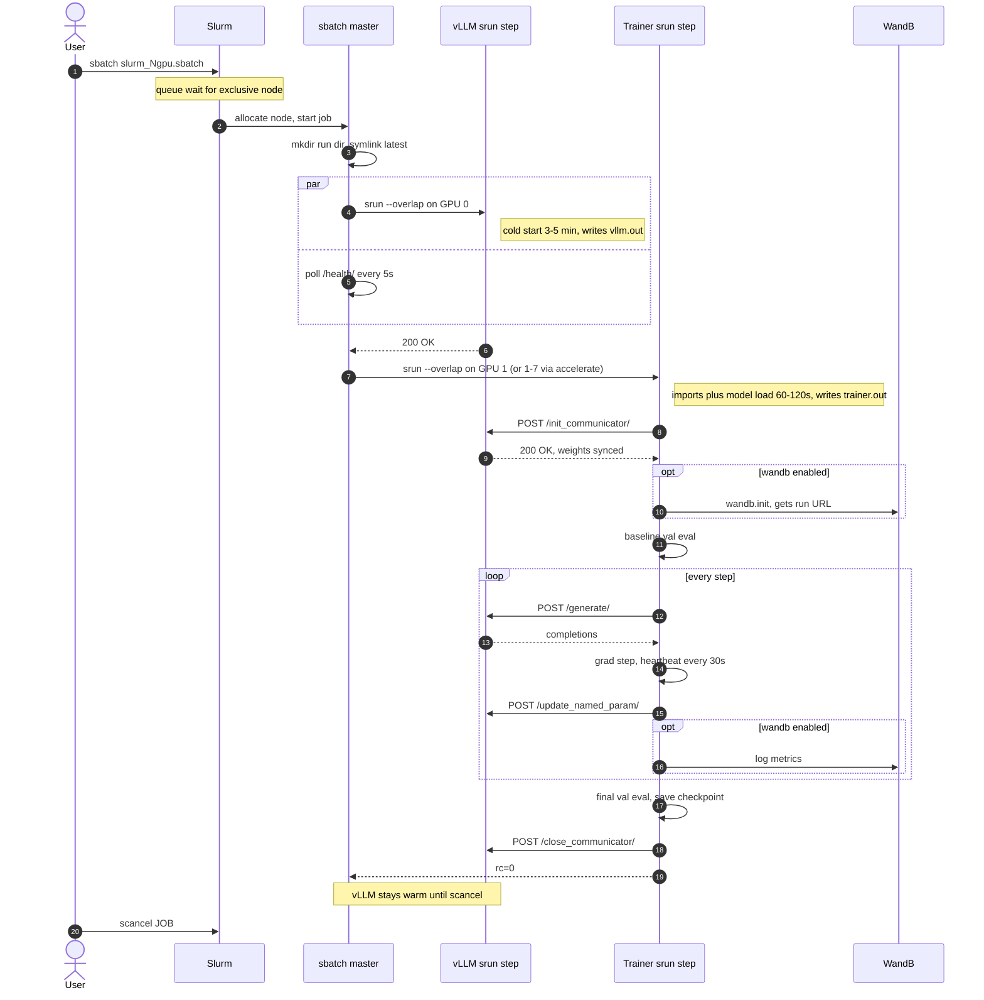

# `h200/` — single H200 node, vLLM + trainer in one exclusive job

End-to-end GRPO on a single H200 node. vLLM and trainer run as **concurrent `srun --overlap` steps inside one exclusive sbatch job**, so the trainer can be killed and re-launched without restarting vLLM (~5 min cold start).

## Layout

```
examples/configs/hpc2/h200/
├── README.md            (this file)
├── slurm_2gpu.sbatch    1 vLLM (GPU 0) + 1 trainer (GPU 1)         — smoke test, fast iteration
└── slurm_8gpu.sbatch    1 vLLM (GPU 0) + 7-rank DDP trainer (1-7)  — saturates the exclusive 8-GPU node
```

Both reserve the whole node (`--exclusive --gpus-per-node=8`) because the cluster doesn't enforce single-tenant GPU allocation — see "Why exclusive?" below.

## Process model: 2gpu vs 8gpu

Both variants have the same shape — one sbatch job, two concurrent `srun --overlap` steps, vLLM on GPU 0, trainer on the rest. The only real difference is how many OS processes the trainer step starts.

| | `slurm_2gpu.sbatch` | `slurm_8gpu.sbatch` |
|---|---|---|
| GPUs used | 1 vLLM + 1 trainer = **2** (6 idle) | 1 vLLM + 7 trainer = **8** (saturates node) |
| **vLLM srun step** | 1 OS process, owns GPU 0 (`CUDA_VISIBLE_DEVICES=0`), TP=1 | _identical_ |
| **Trainer srun step** | 1 OS process: `irl train --devices 1` | 1 srun task that **forks 7 OS processes** via `accelerate launch --num_processes 7 -m inspect_rl.cli train …` |
| Trainer GPU view | `CUDA_VISIBLE_DEVICES=1` | `CUDA_VISIBLE_DEVICES=1,2,3,4,5,6,7` |
| Parallelism | none | PyTorch DDP across 7 ranks |
| Rank 0 ↔ vLLM | yes | yes — and **only** rank 0 (`--num_processes N` shows up as 1 vLLM client, not N; see [`journal/008_multinode/002_rank_gating.md`](../../../journal/008_multinode/002_rank_gating.md)) |
| `trainer.out` shape | one stream | merged stream — `accelerate` prefixes each line with its rank id; only rank 0 emits `[step …]` / `[heartbeat …]` |

### Why `accelerate launch` rather than `irl train --num-processes N`?

`irl train --num-processes N` is intentionally rejected with a redirect message (see top-level [`README.md`](../../../README.md) "Multi-GPU and multi-node"). Multi-process runs must go through `accelerate launch -m inspect_rl.cli train …` because `accelerate` owns rank/PID/device-binding logic. We launch `accelerate` from inside a single srun task; `srun --ntasks=N` is **not** used here because Slurm-managed ntasks would compete with `accelerate` for rank assignment.

For a worked end-to-end of the 8gpu variant (queue wait, cold-start timings, what's actually in each log) see [`journal/009_h200_smoke/002_8gpu_ddp_smoke.md`](../../../journal/009_h200_smoke/002_8gpu_ddp_smoke.md).

Layering, in one picture:

```
sbatch (Slurm)
└── 2 srun --overlap steps (Slurm)
    ├── vLLM srun step → 1 OS process: irl serve
    └── Trainer srun step
        ├── 2gpu: 1 OS process       → irl train (single rank)
        └── 8gpu: 1 OS process (accelerate launcher)
                  └── forks 7 OS processes → inspect_rl.cli train (1 per GPU, DDP)
```

## End-to-end sequence

What happens on `sbatch slurm_{2,8}gpu.sbatch`, what writes which log, and how long each phase typically takes. Step labels match `slurm_2gpu.sbatch`; the 8gpu variant is identical except "Trainer srun step" wraps 7 ranks rather than one.



## Logs

Each run lands under `irl_output_slurm/<stamp>_slurm_<jobid>/` (symlinked as `latest/`):

| File | Writer | Watch with |
|---|---|---|
| `master.out` | sbatch orchestrator + watchdog | `tail -F` while diagnosing startup |
| `vllm.out` | vLLM server | `tail -F` during the cold-start phase |
| `trainer.out` | trainer step, timestamped (`[HH:MM:SS]`) | `tail -F` during training |
| `train.log` | `inspect_rl` structured log (rank 0 only) | post-hoc `grep heartbeat`, `[eval`, `[summary` |
| `eval_logs/NNN_{val,rollout}/` | per-step inspect log dirs | open in inspect viewer |
| `checkpoints/checkpoint-N/` | trainer save | `irl train --resume <run-dir>` from here |
| `report.md` | trainer summary | open first — reward deltas + links |

Typical durations (`tldr` + `Qwen2.5-0.5B-Instruct`):
queue 0s–hours (exclusive node), vLLM cold start ~3.5 min, trainer cold start ~60s for 2gpu / ~3 min for 8gpu (7 ranks each import torch + DDP init), ~8s/step (faster per-sample on 8gpu due to bigger global batch — 28 vs 4), baseline+final val ~45s each.

> **8gpu monitoring footgun.** Under `accelerate launch`, the sbatch's awk `stamp` pipe is block-buffered — `trainer.out` stays near-empty *during* the run and dumps all output at once when the trainer exits. The watchdog in `master.out` will keep firing "idle Ns" the whole time. **Tail `train.log` instead** — that's where rank-0 heartbeats/eval/step lines actually land live (logging via `FileHandler`, which flushes per record). Full debrief and a known bug in the prefetch path (`KeyError: 'inspect_scores'` after warmup on this topology): [`journal/009_h200_smoke/002_8gpu_ddp_smoke.md`](../../../journal/009_h200_smoke/002_8gpu_ddp_smoke.md).

## Quick start

```bash
# `env -u MODEL` guards against a stray MODEL in your shell environment
# overriding the script's default (`sbatch --export=ALL` propagates it).
env -u MODEL sbatch examples/configs/hpc2/h200/slurm_2gpu.sbatch

# Live tail (the three logs that matter):
tail -F irl_output_slurm/latest/{master,vllm,trainer}.out
```

After the trainer step finishes, vLLM stays alive until the job wall-clock
limit (`#SBATCH --time=04:00:00`) or `scancel`. You can re-run the trainer
without paying vLLM's cold start again — see "Fast retry" below.

## Why `--exclusive --gpus-per-node=8`?

This cluster doesn't enforce single-tenant GPU allocation, so Slurm-assigned `CUDA_VISIBLE_DEVICES` can point at a GPU another tenant is filling — vLLM then OOMs at startup. Reserving the whole node sidesteps this; vLLM runs on physical GPU 0 (`CUDA_VISIBLE_DEVICES=0`), trainer on physical GPU 1 (`CUDA_VISIBLE_DEVICES=1` + `--devices 1`). Don't change `--devices` — `irl train` re-exports `CUDA_VISIBLE_DEVICES` from it, so `--devices 0` would collide with vLLM. Background on the shared-cluster failure modes: top-level [`README.md`](../../../README.md) "Coding agent guidance".

## Output layout

Each run lands under `irl_output_slurm/<stamp>_slurm_<job_id>/`, with a
convenience symlink `irl_output_slurm/latest` pointing at it:

```
irl_output_slurm/<stamp>_slurm_<job_id>/
├── master.out          sbatch orchestrator (vllm-ready, watchdog, cleanup)
├── vllm.out            vLLM server log (raw)
├── trainer.out         trainer step log, every line `[HH:MM:SS]`-prefixed
├── train.log           trainer's own structured log (inspect_rl.util.display)
├── manifest.json       run hparams (model, steps, batch, lr, …)
├── report.md           final summary: reward deltas, per-step table, artifact links
├── checkpoints/
│   └── checkpoint-N/   step-N checkpoint (LoRA adapter, optimizer, scheduler, RNG)
└── eval_logs/
    ├── 000_val/        baseline val (before training)
    ├── 001_rollout/    step 1 GRPO rollout
    ├── 002_rollout/    step 2 GRPO rollout
    └── 002_val/        final val (after training)
```

Open `report.md` first — it has the reward deltas and links to everything else.

## Fast retry (vLLM stays warm)

When the trainer crashes or you tweak hparams, don't resubmit (you'd eat the ~5 min vLLM cold start again). The sbatch's own `master.out` prints a ready-to-paste `srun --jobid=… --overlap …` retry snippet at the end of every trainer step — copy that. Always reset the NCCL communicator first (see [`journal/009_h200_smoke/001_debugging_practices.md`](../../../journal/009_h200_smoke/001_debugging_practices.md)). When done, `scancel $JOB`.

## Overridable env vars

| Var | Default | Notes |
|---|---|---|
| `MODEL` | `Qwen/Qwen2.5-0.5B-Instruct` | Must be cached under `$HF_HOME` (script runs offline) |
| `HF_HOME` | _(unset → HF default `~/.cache/huggingface`)_ | Point at a shared cache on cluster scratch to avoid per-node re-downloads |
| `EXAMPLE` | `tldr` | One of `tldr`, `magic-number`, `math-agent`, `gsm8k` |
| `MAX_STEPS` | `2` | Bump for real runs (200+ for tldr is typical) |
| `VLLM_PORT` | `8000` | Change if multiple vLLM jobs share a node |
| `IDLE_WARN_S` | `60` | Watchdog yells in master.out if trainer.out goes this long without a new line |

Example:

```bash
env -u MODEL sbatch \
    --export=ALL,MODEL=Qwen/Qwen2.5-0.5B-Instruct,EXAMPLE=tldr,MAX_STEPS=20 \
    examples/configs/hpc2/h200/slurm_2gpu.sbatch
```

## Known gotchas

- **Dataset on first run**: `tldr` pulls `trl-lib/tldr` from Hugging Face on
  first launch. Compute nodes need egress for this; subsequent runs hit
  `$HF_HOME`.
- **First trainer attempt after a crashed vLLM init**: if a previous trainer
  errored inside vLLM's `init_communicator` (e.g. same-CUDA-device bug),
  vLLM ends up in a poisoned state where it returns 200 but never opens
  the TCPStore port 51216. Symptom: trainer times out with
  `client socket has timed out … (vllm-node, 51216)`. Fix: `scancel` the
  whole job and resubmit (vLLM needs a fresh process).
- **Block-buffered Python output**: trainer logs only appear when buffered
  output flushes, unless `PYTHONUNBUFFERED=1` (which `slurm.sbatch` now
  sets). Without it, you may see watchdog idle warnings while the trainer
  is in fact making progress.

## Scaling up

For 8B-class models on the same single-node topology, swap `slurm_8gpu.sbatch` (1 vLLM TP=1 + 7-rank DDP). For larger (≥13B) you'll want FSDP/ZeRO-3 — mirror the `accelerate.yaml` pattern from `examples/configs/hpc1/4node/`. Not yet wired here; PR welcome.
